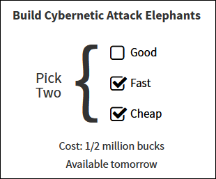
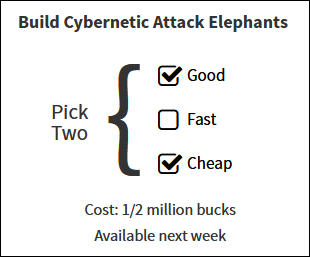
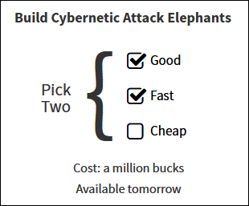

# Good, Fast, Cheap: pick 2

## Game Mechanic

I'm not sure where the term first originated (engineering?) but there's a 
saying:  
"Good, Fast, Cheap: pick 2."

If you want a GOOD product done FAST, it won't be CHEAP.  
If you want a CHEAP product delivered FAST, it won't be GOOD.  
If you want a GOOD product at a CHEAP price, you won't get it FAST.  

A lot of games (particularly strategy games) embody this sort of mechanic in
indirect ways without making it explicit: in a game like StarCraft you can 
build a bunch of cheap units very quickly, but they won't be very strong and are
easily defended against.

## Example: Research & Engineering in strategy games

Tons of games feature a "research" mechanic where you can unlock new technology
by investing in research, and a separate "engineering" or "construction"
mechanic where you take previously-unlocked technology and produce concrete
instances of it. E.g., you research the concept of e.g. a water purifier first, 
and then you can build water purifiers.

This is a suitable abstraction for many games, but I think it would be cool to
build an entire game around this real-life tradeoff, but make it front and
center to your decision making, not as a buried implicit consequence of other
choices.

Okay, say I'm Emperor Larsius Prime CLXVII of Planet Lars, home of the Lartians. The foul
earthlings are invading our sacred homeland under the foul banner of some dude named
"Musk." There's only one thing to do -- deploy the Cybernetic Attack Elephants!

This is one way we could go. The Elephants will be ready tomorrow, and it'll
only cost a 1/2 million bucks. But, there's no guarantee that The Elephants
won't spontaneously explode during mobilization, start randomly trampling our
own troops, or just generally fail to live up to the hype of our defense 
contractors.

Okay, fine, let's insist on GOOD.

Alright, now I can sleep better at night. The Elephants are going to perform as
close to spec as possible, so I can focus on probing the enemy's weaknesses
rather than worrying about my own. But these Elephants will do me no good if I
can't get them across the Tartarus Montes in time to keep the earthlings from
seizing our capital

Sigh... let's go with FAST. What's the damage?

Okay, so we'll have top-quality Cybernetic Attack Elephants AND they'll be ready
to go tomorrow to give Mr. Musk and his terran hordes what-for. But it's gonna
cost us a full million bucks, and wouldn't you know it, with the terrestrial
war in full blast we're gonna have a hard time getting our hands on any more
male deer anytime soon. Time for some deficit spending I guess, the motherland
is worth it!

## Okay, so what?

The whole point of this idea is to build an entire game around the Good/Fast/Cheap
triangle, AND to make that relationship explicit so that this tradeoff is
always at the forefront of what the player is deciding about.

This sort of game would de-emphasize decisions like "I guess Zerglings are the
best choice here," and "I'll invest in double-plated starship hulls even though 
it makes the ships heavier and cost more". Instead, the focus will be on a smaller
number of overall choices, any and all of which can come in GOOD/FAST/CHEAP varieties, 
and make you always think about which two you want in which situations.
